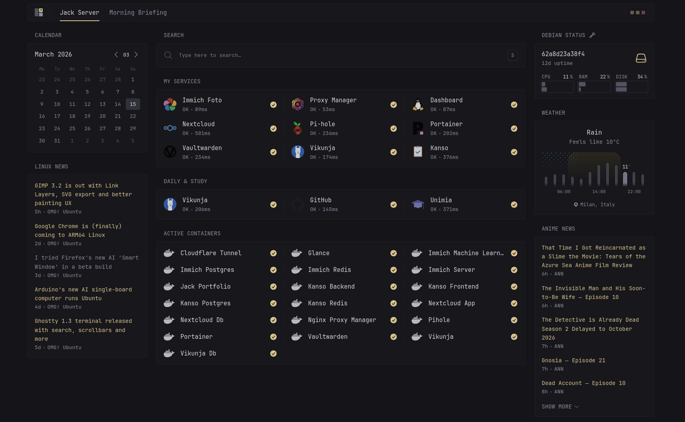

# Homelab

Docker Compose configurations for my self-hosted server environment. The infrastructure consists of a single Debian machine, with everything running in containers to keep the host OS clean.

## Services

* **Glance**: Dashboard for a quick overview of all running services.
* **Immich**: Media file backup and management.
* **Kanso Project**: Self-hosted habit tracker. -> [kanso](https://kanso.jack-lab.dev/)
* **Nextcloud**: Cloud storage for files and server backups.
* **Nginx Proxy Manager**: Reverse proxy management.
* **Portainer**: Docker container monitoring.
* **Portfolio**: Hosting for my personal website. -> [deep_mind](https://portfolio.jack-lab.dev/)
* **Vaultwarden**: Password manager backend, synced across all devices via Bitwarden.
* **Vikunja**: Kanban-style task manager for university projects.

## Structure

Sensitive data, data volumes, and real `.env` files are excluded via `.gitignore`.
Each directory contains the necessary `docker-compose.yml` and a `.env.example` reference file.
